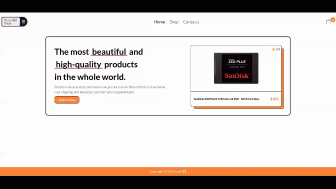
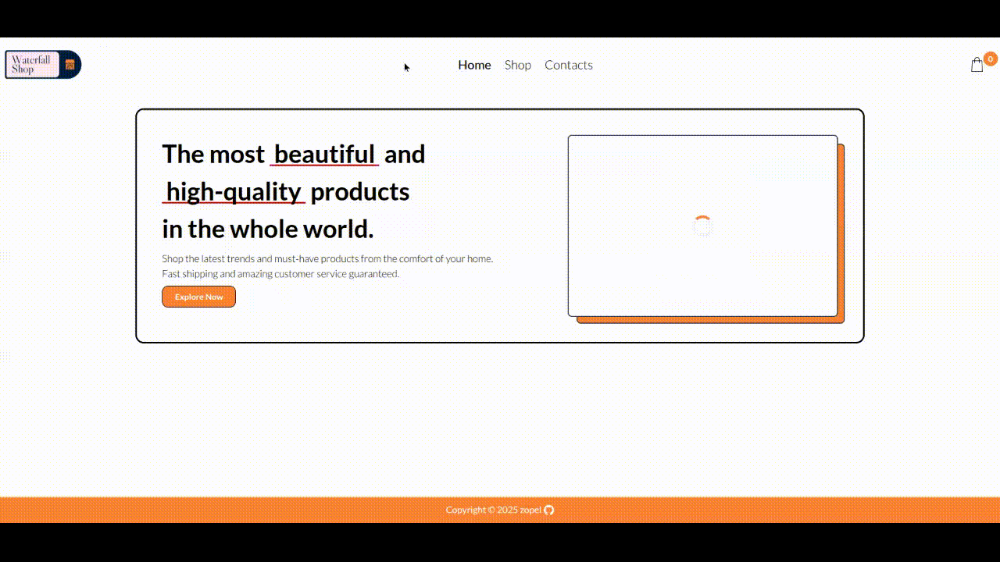

# Waterfall Shopping

This project presents a functional online shopping application where users can browse a catalog of products, add items to their cart, and place orders. Upon successful checkout, an order confirmation is sent directly to the user's email, ensuring a smooth and transparent purchasing process.

[**View Live Demo**](https://waterfall-shopping.vercel.app/) | [**Browse Source Code**](https://github.com/ZTanvir/waterfall-shopping)

https://github.com/user-attachments/assets/5efa3596-a6ee-4a0e-9c28-28177cc4d928

## Core functionalities

- Implemented and compared different data patterns, specifically Fetch-then-Render (waterfall) vs. Render-then-Fetch (parallel) to optimize the user experience.
- Fetch data from api.
- Filter products based on category.
- Sort products based on rating and price.
- Send product order with products list to owner via email.
- Integrated a Leaflet Map to display physical store locations with custom markers.

## Technologies used

- React
- Javascript
- Axios
- Swr
- React router
- Css module
- Vite

## Purpose & Goal

The primary objective of this project was to solidify my React.js fundamentals by building a production-ready application. By moving beyond basic tutorials, I focused on mastering professional patterns like client-side routing with React Router and efficient state management using core hooks to handle complex UI logic and side effects.

A key focus of this project was optimizing the data layer. Instead of traditional fetching, I implemented SWR (Stale-While-Revalidate) to ensure a "fast-first" user experience. This approach eliminated UI inconsistencies and the "blank screen" effect by leveraging caching and background synchronization, allowing the application to remain highly responsive even during data updates.

## Killer features

### **Fetching Patterns:**

In this project, I explored how data fetching impacts UI perceived performance:

**Fetch-then-Render**: The application waits for all data to arrive before showing the component.In the home page all product has been fetch first.Then the products has pass to shop page.This result smooth ui transition in shop page product list section.



**Render-then-Fetch**: The component mounts immediately (often showing a loading circle), and data is fetched as the user starts interacting with the page.

As a result users are more likely to stick towards the application then move to else where.



### **Search,filter and categorize product :**

The shop features a robust filtering and sorting system that allows users to pivot products by category, price, and user ratings without page reloads.

### **Interactive Store Locator:**

Using Leaflet.js, the app features an interactive, high-performance map with custom-branded markers, allowing user to locate contacts shop.

## Lesson learned

### **Avoid deeply nested props passing**

One of the key challenges in this project was managing data flow across a complex component tree. I have done it with `prop drilling`.It raise these issues -

- As the application grew, it became difficult to track where data originated and where it was being modified, making debugging more time-consuming.

- Passing props through "middleman" components caused unnecessary re-renders. When a top-level state updated, every component in the chain would re-evaluate, even if it didn't use the data itself.

This issue can be solved with `React Context API`.I will remove props from intermediary components.

### **Javascript array method remove complexity**

Early in the project, I realized that managing complex state updates and product filtering using manual loops was error-prone and difficult to read. Switching to ES6+ Array Methods significantly reduced code complexity and improved maintainability.

**reduce():** This was a "life saver" for the shopping cart logic. I used it to transform the array of selected items into a single value—calculating the total price and total item count with just a few lines of code.

```
const totalPrice = cart.reduce(
    (acu, cur) => acu + cur.price * cur.amount,0);
```

**filter():** I have used filter to find product based on user search.

```
const filterProduct = initialProduct.filter((product) =>
    product.title.toLowerCase().includes(searchText.toLowerCase())
);
```

### **The Architecture Trade-off: Fetching Strategies**

During development, I explored the trade-offs between different data-fetching patterns. I learned that there is no "perfect" solution; the best choice depends on the desired user experience.

**Render-then-Fetch:**
The component mounts immediately and triggers the data fetch afterward.

The Trade-off: The user sees the UI (and usually a loading screen) right away. This reduces perceived waiting time because the app feels `live` immediately, though the user has to wait a moment for the actual data to pop in.

**Fetch-then-Render:**
The application fetches all necessary data before the component is allowed to render.

The Trade-off: While this slightly increases the initial loading time, it results in a smoother UI transition. Once the content appears, it is fully populated, preventing the `layout shift`.

## Getting Started

To get a local copy of this project up and running, follow these steps.

### Prerequisites

- **Node.js** (v18.x or higher) and **npm** or **yarn**.
- **Npm**: If you prefer using npm for package management and running scripts.

## Installation

1. **Clone the repository:**

   ```bash
   git clone https://github.com/ZTanvir/waterfall-shopping.git
   cd waterfall-shopping
   ```

2. **Install dependencies:**

   Using Npm:

   ```bash
   npm install
   ```

3. **Start the development server:**

   ```bash
   npm run dev
   ```

   Open [http://localhost:5173/](http://localhost:5173/) to view the app in your browser.

### API Documentation

The API documentation for this application is available at [https://fakestoreapi.com/](https://fakestoreapi.com/). It details all endpoints and their usage.
